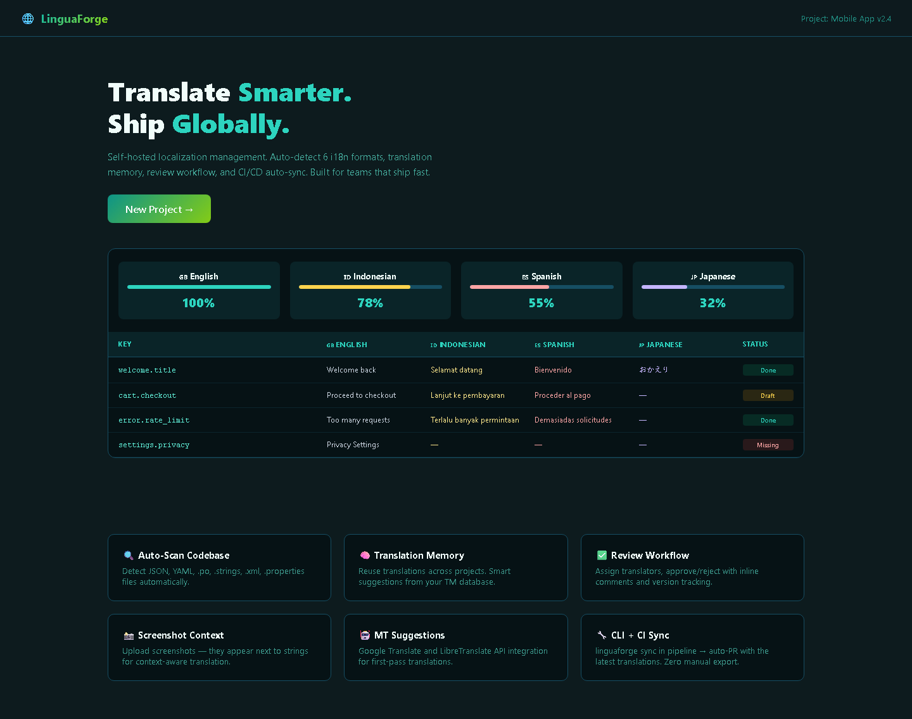

# LinguaForge — Localization Management Platform

[](LICENSE)
[](https://www.typescriptlang.org/)
[](https://nextjs.org/)

Self-hosted translation management. Auto-detects i18n files in six formats, tracks translation progress per locale, supports review workflows, and syncs back to your repo via CLI and CI.

## Screenshots

| Translation Progress Dashboard | Multi-Locale String Table |
|:---:|:---:|
|  |  |

## Features

- Auto-detects JSON, YAML, .po, iOS .strings, Android XML, and .properties files
- Translation progress bars per locale with missing and duplicate key detection
- Translation memory: suggests matches from previously translated strings
- Review workflow: assign translators, approve or reject with comments
- Screenshot upload for translation context
- Machine translation suggestions via Google Translate or LibreTranslate API
- CLI tool and CI integration: run `linguaforge sync` in a pipeline to auto-PR translations

## Quick Start

```bash
git clone https://github.com/adlptv/linguaforge.git
cd linguaforge
pnpm install
pnpm dev
```

Or:
```bash
docker-compose up
```

## Architecture

```
apps/linguaforge/
├── src/app/          # Pages: landing, projects, strings, review, export, settings
│   └── api/          # projects, strings, import, export, scan, health
├── src/components/   # StringEditor, LocaleTable, ReviewPanel, ScreenshotContext, UI primitives
├── src/lib/          # Format parsers (JSON, YAML, .po, .strings, .xml, .properties), validators (Zod)
├── prisma/           # SQLite: Project, Locale, String, Translation, TranslationMemory, User
└── tests/
```

## Supported Formats

| Format | Import | Export | Auto-Detect |
|--------|--------|--------|-------------|
| JSON (i18next) | Yes | Yes | Yes |
| YAML | Yes | Yes | Yes |
| .po (gettext) | Yes | Yes | Yes |
| .strings (iOS) | Yes | Yes | Yes |
| .xml (Android) | Yes | Yes | Yes |
| .properties (Java) | Yes | Yes | Yes |

## API

| Method | Endpoint | Purpose |
|--------|----------|---------|
| GET/POST | /api/projects | List or create projects |
| GET/PUT/DELETE | /api/projects/[id] | Manage a project |
| GET/POST | /api/projects/[id]/strings | List or add strings |
| GET/PUT/DELETE | /api/projects/[id]/strings/[sid] | Edit a string entry |
| POST | /api/projects/[id]/import | Import i18n file |
| GET | /api/projects/[id]/export | Export translations |
| POST | /api/projects/[id]/scan | Scan for missing and duplicate keys |
| GET/POST | /api/translation-memory | Translation memory entries |
| GET | /api/health | Health check |

## Security

- Zod validation on all routes
- RBAC roles: admin, translator, viewer
- API key authentication for CLI
- Rate limiting
- Helmet.js headers

## License

MIT